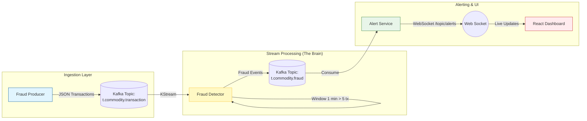

# 🛡️ Real-Time Fraud Detection Engine


A high-throughput, event-driven microservices architecture designed to detect financial fraud patterns in real-time. This system ingests simulated transaction data, applies stateful stream processing rules (like velocity checks) using **Kafka Streams**, and pushes instant alerts to a **React** dashboard via **WebSockets**.

---

## 🏗️ System Architecture

The system follows a decoupled, event-driven pipeline where microservices communicate strictly via Apache Kafka topics.


## 🚀 Key Features

* **Event-Driven Architecture:** Decoupled microservices communicating strictly via Apache Kafka.
* **Stateful Stream Processing:** Implements **Time Windowing** to detect "High Frequency" attacks (e.g., >5 transactions/minute by a single user).
* **Real-Time Alerts:** Sub-millisecond latency from transaction generation to frontend visualization.
* **WebSocket Integration:** Bridges the backend Kafka consumer with a frontend React client using the **STOMP** protocol.
* **Scalable Infrastructure:** Dockerized Kafka environment with Zookeeper and Kafka UI.

## 🛠️ Tech Stack

| Component | Technology | Description |
| :--- | :--- | :--- |
| **Backend** | Java 21, Spring Boot 3 | Microservices implementation |
| **Messaging** | Apache Kafka | Event streaming platform |
| **Processing** | Kafka Streams API | Real-time analytics and windowing |
| **Frontend** | React.js | Live monitoring dashboard |
| **Protocols** | STOMP, SockJS | WebSocket communication |
| **DevOps** | Docker, Docker Compose | Containerization and orchestration |

## 📂 Project Structure

```text
kafka-fraud-engine/
├── fraud-producer/       # Service 1: Simulates high-speed credit card transactions
├── fraud-detector/       # Service 2: The "Brain" (Kafka Streams analysis)
├── alert-service/        # Service 3: Bridges Kafka alerts to WebSockets
├── fraud-dashboard/      # Service 4: React Frontend
└── docker-compose.yml    # Infrastructure setup (Kafka, Zookeeper, UI)
```

## ⚡ Getting Started

### Prerequisites
* Java 17 or 21
* Docker Desktop
* Node.js & NPM

### Step 1: Start Infrastructure
Spin up the Kafka ecosystem using Docker.
```bash
docker-compose up -d
```
*Verify: Open http://localhost:8080 to see the Kafka UI.*

### Step 2: Run Microservices
You can run these via IntelliJ IDEA or the terminal (Maven). Open 3 separate terminals:

**1. Start the Producer (Generates Data):**
```bash
cd fraud-producer
./mvnw spring-boot:run
```

**2. Start the Detector (Analyzes Streams):**
```bash
cd fraud-detector
./mvnw spring-boot:run
```

**3. Start the Alert Service (Listens for Frauds):**
```bash
cd alert-service
./mvnw spring-boot:run
```

### Step 3: Start the Dashboard
Navigate to the frontend folder and start the React server.
```bash
cd fraud-dashboard
npm install
npm start
```
*The dashboard will open automatically at http://localhost:3000.*

---

## 🧠 Fraud Detection Rules

This engine implements two specific types of detection rules to demonstrate **Stateless** and **Stateful** processing.

### Rule 1: Large Amount (Stateless)
* **Scenario:** A thief tries to withdraw a huge sum at once.
* **Logic:** Flag any transaction where `amount > 10,000`.
* **Code Implementation:**
```java
stream.filter((key, tx) -> tx.getAmount() > 10000)
```

### Rule 2: Velocity / High Frequency (Stateful)
* **Scenario:** A thief makes many small purchases quickly to avoid detection.
* **Logic:** Flag if a specific `userID` performs **> 5 transactions** within a **1-minute** fixed window.
* **Code Implementation:**
```java
stream.groupByKey()
      .windowedBy(TimeWindows.ofSizeWithNoGrace(Duration.ofMinutes(1)))
      .count()
      .filter((key, count) -> count > 5)
```


---
*Developed by Anish Pal
